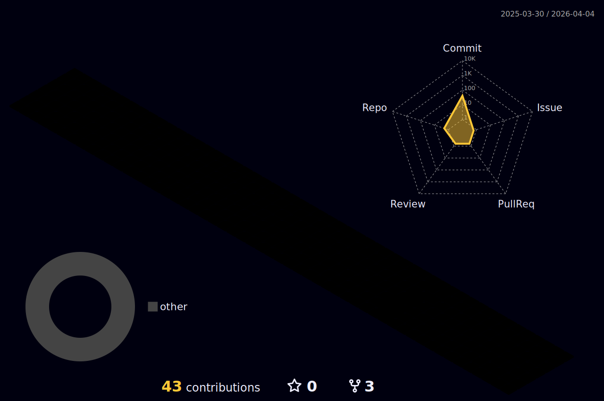

 

<h1 align="center">ʜɪ ꜰʀɪᴇɴᴅꜱ, ɪ'ᴍ ᴘᴀɴᴅᴀ </h1>

  

 

    <picture><picture>

 

###  ᴛᴏᴏʟꜱ

  

### ᴛᴇᴄʜ ꜱᴛᴀᴄᴋ

  

  

###  ᴄᴏɴɴᴇᴄᴛ ᴡɪᴛʜ ᴍᴇ

    
    

  

### 📊 ɢɪᴛʜᴜʙ ᴀᴄᴛɪᴠɪᴛʏ

  

  

###

### ✍️ ʀᴀɴᴅᴏᴍ ᴅᴇᴠ Qᴜᴏᴛᴇ

  
  
  

### 🎮 ᴘʟᴀʏ ɢᴀᴍᴇꜱ ᴡɪᴛʜ ᴍᴇ 😊

<picture>
  <source media="(prefers-color-scheme: dark)" srcset="https://raw.githubusercontent.com/mcdygaming/mcdygaming/output/pacman-contribution-graph-dark.svg">
  <source media="(prefers-color-scheme: light)" srcset="https://raw.githubusercontent.com/mcdygaming/mcdygaming/output/pacman-contribution-graph.svg">
  
</picture>

###

